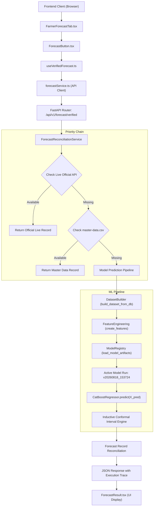

# CropMandi AI Active Runtime Dependency Graph

## End-to-End Application Flow

---

## Detailed Runtime Call Stack

1. **Frontend Trigger**:
   - `frontend/src/components/FarmerForecastTab.tsx` (`handleGenerateForecast()`)
   - `frontend/src/components/forecast/ForecastButton.tsx` (`ForecastButton`)
   - `frontend/src/hooks/useVerifiedForecast.ts` (`generateForecast()`)
   - `frontend/src/services/forecastService.ts` (`fetchVerifiedForecast()`)

2. **Backend API Entry**:
   - `backend/app/routers/forecast.py` (`@router.get("/verified")`)
   - `backend/app/schemas/forecast.py` (`VerifiedForecastRequest`, `VerifiedForecastResponse`)

3. **Reconciliation & Source Resolver**:
   - `backend/app/services/forecast_reconciliation_service.py` (`reconcile_verified_forecast()`)
   - `backend/app/services/official_market_sync_service.py` (`fetch_daily_market_data()`)
   - `backend/app/services/master_data_service.py` (`get_master_data_price()`)

4. **Machine Learning Feature & Inference Core**:
   - `backend/app/ml/predict.py` (`generate_3day_prediction()`)
   - `backend/app/ml/dataset_builder.py` (`build_dataset_from_db()`)
   - `backend/app/ml/feature_engineering.py` (`create_features()`)
   - `backend/app/ml/arrival_features.py` (`build_arrival_features()`)
   - `backend/app/ml/weather_features.py` (`build_weather_features()`)
   - `backend/app/ml/cross_market_features.py` (`build_cross_market_features()`)
   - `backend/app/ml/seasonal_features.py` (`build_seasonal_features()`)
   - `backend/app/ml/model_registry.py` (`load_model_artifacts()`)
   - Model Files: `ml/models/catboost_h1_vv20260818_153724.cbm`, `catboost_h2_vv20260818_153724.cbm`, `catboost_h3_vv20260818_153724.cbm`
   - `backend/app/ml/prediction_intervals.py` (`apply_prediction_interval()`)

5. **UI Rendering**:
   - `frontend/src/components/forecast/ForecastResult.tsx` (`ForecastResult`)
   - `frontend/src/components/forecast/ClosestMarketsSection.tsx` (`ClosestMarketsSection`)
